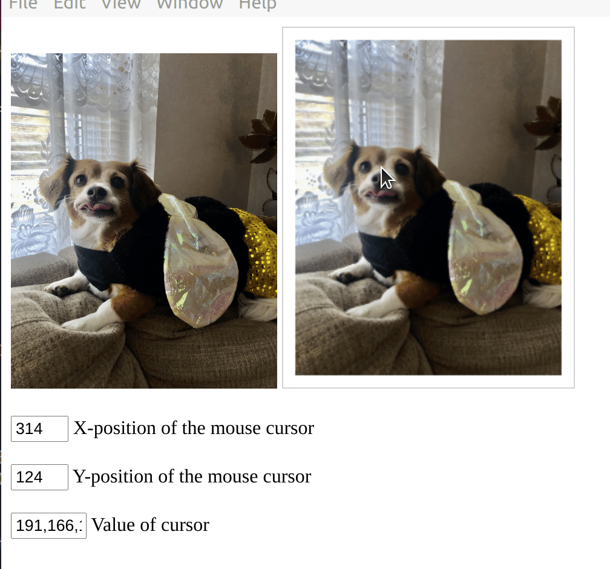

Trying to do cool stuff to images

```
# Clone this repository
git clone https://github.com/electron/image_sssp
# Go into the repository
cd image_sssp
# Install dependencies
npm install
# Run the app
npm start

```


